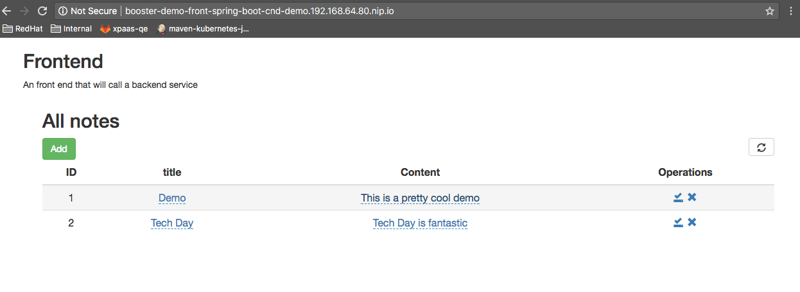

# Instructions

## Prerequisite

- MiniShift created with OCP 3.7.1 and launched using experimental features

The following invocation of `bootstrap_vm.sh` sets up the aforementioned dependencies  

```bash
./bootstrap_vm.sh
```

- Install your "my-Launcher"

**NOTE** : Replace the `gitUsername` and `gitPassword` parameters with your `github account` and `git token` in ordet to let the launcher to create a git repo within your org.

```bash
./deploy_launcher.sh -p my-launcher \
                     -i admin:admin \
                     -g gitUsername:gitPassword \
                     -c https://github.com/snowdrop/cloud-native-catalog.git
```

## Test Launcher

Open the `launcher` route hostname

```bash
LAUNCH_URL="http://$(oc get route/launchpad-nginx -n my-launcher -o jsonpath="{.spec.host}")"
open $LAUNCH_URL
```

## Demo Scenario

1) Use launcher to generate a Cloud Native Demo - Front zip

- From the `launcher application` screen, click on `launch` button


- Within the deployment type screen, click on the button `I will build and run locally`
- Next, select your mission : `Cloud Native Development - Demo Backend : JPA Persistence`


- Choose `Spring Boot Runtime`
- Accept the `Project Info`
- Finally click on the button Select `Download as zip file`
- Unzip the generated project
```bash
mkdir -p cloud-native-demo
cd cloud-native-demo
mv ~/Downloads/booster-demo-front-spring-boot.zip .
unzip booster-demo-front-spring-boot.zip
cd booster-demo-front-spring-boot
```

- Build and launch spring-boot application locally to ensure the application can be used in your browser
```bash
mvn clean spring-boot:run 
open http://localhost:8090
```
- Create a new OpenShift project on OCP
```bash
oc new-project cnd-demo
```
- Deploy the application on the cloud platform using the `s2i` build process
```bash
mvn package fabric8:deploy -Popenshift
```

2) Create a MySQL service instance using the Service Catalog

! Use the Web UI to create the Service and bind it. 
Alternatively, execute the following command using the definition file provided with the backend application (which is the subject of the next step) in order to create a serviceInstance for MySQL

```bash
oc create -f openshift/mysql_serviceinstance.yml
```


3) Use launcher to generate a Cloud Native Demo - Backend zip
   
- From the first screen, click on `launch` button
- Within the deployment type screen, click on the button `I will build and run locally`
- Next, select your mission : `Cloud Native Development - Demo Front`


- Choose the `Spring Boot Runtime`
- Accept the `Project Info`
- Finally click on the button Select `Download as zip file`
- Unzip the project generated
```bash
cd cloud-native-demo
mv ~/Downloads/booster-demo-backend-spring-boot.zip .
unzip booster-demo-backend-spring-boot.zip
cd booster-demo-backend-spring-boot
```
- Build, launch spring-boot locally to test the in-memory H2 database
```bash
mvn clean spring-boot:run -Dspring.profiles.active=local -Ph2
curl -k http://localhost:8080/api/notes 
curl -k -H "Content-Type: application/json" -X POST -d '{"title":"My first note","content":"Spring Boot is awesome!"}' http://localhost:8080/api/notes 
curl -k http://localhost:8080/api/notes/1
```

- Deploy the application on the cloud platform using the `s2i` build process
```bash
oc new-project cnd-demo
oc new-app -f openshift/cloud-native-demo_backend_template.yml
```

- Start the build using project's source
  
```bash
oc start-build spring-boot-db-notes-s2i --from-dir=. --follow
```
- Wait until the build and deployment complete !!

- Bind the credentials of the ServiceInstances to a Secret

```bash
oc create -f openshift/mysql-secret_servicebinding.yml
```

- Next, mount the secret of the MySQL service to the `Deploymentconfig` of the backend

```bash
oc env --from=secret/spring-boot-notes-mysql-binding dc/spring-boot-db-notes
```

**NOTE**: If you create the service using the UI, then find the secret name of the DB and next click on the `add to application` button
to add the secret to the Deployment Config of your application

- Wait until the pod is recreated and then test the service



```bash
export BACKEND=$(oc get route/spring-boot-db-notes -o jsonpath='{.spec.host}' -n cnd-demo)
curl -k $BACKEND/api/notes 
curl -k -H "Content-Type: application/json" -X POST -d '{"title":"My first note","content":"Spring Boot is awesome!"}' $BACKEND/api/notes 
curl -k $BACKEND/api/notes/1
```
## Enable OpenTracing

1. Install Jaeger on OpenShift to collect the traces

```bash
oc project jaeger
oc process -f https://raw.githubusercontent.com/jaegertracing/jaeger-openshift/master/all-in-one/jaeger-all-in-one-template.yml | oc create -f -
```

- Create a route to access the Jaeger collector

```bash
oc expose service jaeger-collector --port=14268 -n tracing
```

- Specify next the url address of the Jaeger Collector to be used
- Get the route address

```bash
oc get route/jaeger-collector --template={{.spec.host}} -n tracing 
```
    
Add the following jaeger properties to the application.yml file with the route address of the collector

jaeger:
  protocol: HTTP
  sender: http://jaeger-collector-tracing.192.168.64.80.nip.io/api/traces

## Bonus

- Install Istio 0.4.0

```bash
pushd $(mktemp -d)
echo "Git clone ansible project to install istio distro, project on openshift"
git clone https://github.com/istio/istio.git && cd istio/install/ansible

export ISTIO_VERSION=0.4.0 #or whatever version you prefer
export JSON='{"cluster_flavour": "ocp","istio": {"release_tag_name": "0.4.0, "auth": false}}'
echo "$JSON" > temp.json
ansible-playbook main.yml -e "@temp.json"
rm temp.json
```


