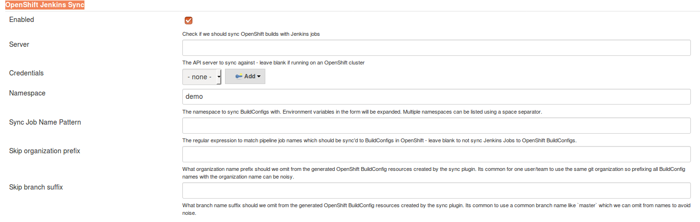
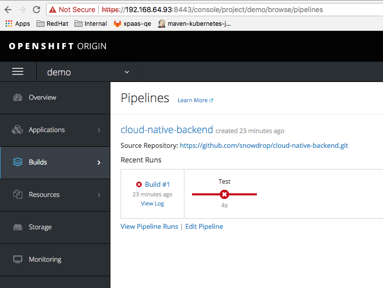
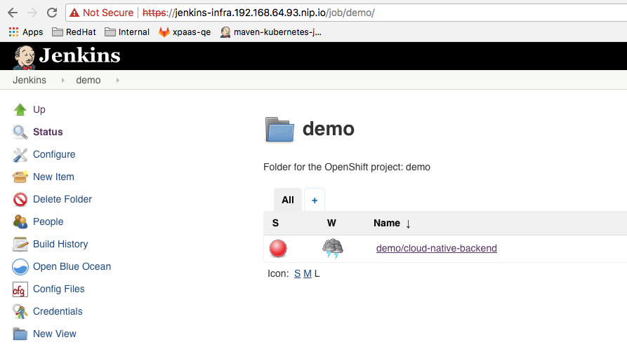

# Instructions to configure pipeline and jenkins installed in a different namespace

- Start Minishift using Openshift 3.7
```bash
minishift start
minishift config set image-caching true
minishift config view 
- cpus                 : 2
- image-caching        : true
- memory               : 5GB
- openshift-version    : v3.7.1
- vm-driver            : xhyve

oc login -u admin -p admin
```

- Create the `demo` project where the pipeline will be deployed

```bash
oc new-project demo
```

- Create project where Jenkins will live

```bash
oc new-project infra
```

- Launch Jenkins

```bash
oc new-app jenkins-persistent -n infra -p MEMORY_LIMIT=768Mi
```

We need the persistent Jenkins image because we will be making one change to Jenkins configuration

- Give Jenkins the necessary permissions to allow it to edit the `demo` namespace

```bash
oc adm policy add-cluster-role-to-user edit system:serviceaccount:infra:jenkins -n demo
```

- Configure Opeshift Sync plugin 

From the Jenkins UI, Go to `Manage Jenkins` -> `Configure`.
Under the `OpenShift Jenkins Sync` section, change the `Namespace` field to `demo`

  


- Deploy the jenkins `pipeline` using the `Jenkinsfile` part of the github `cloud-native-backend` project 

```bash
oc project demo
git clone https://github.com/snowdrop/cloud-native-backend.git && cd cloud-native-backen
oc new-build --strategy=pipeline https://github.com/snowdrop/cloud-native-backend.git
```

- Then now, you should be able to see that your pipeline has started

 

- And that the job `demo/cloud-native-backend` has been created under the jenkins instance
  running within the `infra` namespace

 


